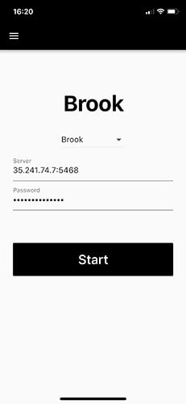

# 小众好用的代理软件 — Brook

## 1. Brook简介
[Brook](https://github.com/txthinking/brook) 是一个高效的 Socks5 代理软件，官方支持Windows、Linux、MacOS、IOS、Android、树莓派等设备，同时是使用 Golang 语言编写，安装、使用异常简单。

Brook 支持 自主研发 Brook（新版） 协议+Stream Brook（旧版）协议、Shadowsocks 协议、SOCKS5 协议、TCP/UDP 转发、SOCKS5代理转HTTP代理 等功能。

Brook 支持 UDP转发，无需任何设置。

支持单端口和多端口(每个端口可以单独设定密码)，这点类似于 Shadowsocks 和 ShadowsocksR 的单用户服务端。

## 2. Brook上手

### 2.1 服务端
除了使用第三方提供的Brook节点外，相信小伙伴们已经迫不及待的想自建服务器，小试身手了，话不多说，这就操练起来吧...

Brook服务端支持Linux/mac OS/Windows，我们这里还是选择以Linux为例。

#### 2.1.1 官方脚本
```sh
# 切换到root
$ sudo -i
# 校准时间
$ cp /usr/share/zoneinfo/Asia/Shanghai /etc/localtime

# 安装官方脚本。 最新版脚本地址可以从官方 https://github.com/txthinking/brook/releases
$ wget https://github.com/txthinking/brook/releases/download/v20181212/brook
$ chmod -R 744 brook
$ ./brook

# 以服务方式开机启动。不同发行版Linux，命令不同此处以Debian9为例
$ screen -dmS brook ./brook server -l :5468 -p xinzhe468brook # -l指定端口，-p指定密码
```

#### 2.1.2 第三方一键安装脚本
此脚本除了一键安装Brook还提供了管理功能。

系统要求：CentOS 6+ / Debian 6+ / Ubuntu 14.04 +

```sh
# 切换到root
$ sudo -i
# 校准时间
$ cp /usr/share/zoneinfo/Asia/Shanghai /etc/localtime
# 一键安装
$ wget -N --no-check-certificate https://raw.githubusercontent.com/ToyoDAdoubi/doubi/master/brook.sh && chmod +x brook.sh && bash brook.sh
```
按一下提示安装即可。
```
0. 升级脚本
————————————
 1. 安装 Brook
 2. 升级 Brook
 3. 卸载 Brook
————————————
 4. 启动 Brook
 5. 停止 Brook
 6. 重启 Brook
————————————
 7. 设置 账号配置
 8. 查看 账号信息
 9. 查看 日志信息
10. 查看 链接信息
————————————
 
 当前状态: 已安装 并 已启动
 
 请输入数字 [0-10]:
```

> 常用操作

操作|命令
:-|:-
启动|/etc/init.d/brook start
停止|/etc/init.d/brook stop
重启|/etc/init.d/brook restart
查看状态|/etc/init.d/brook status
安装目录|/usr/local/brook
配置文件|/usr/local/brook/brook.conf
日志文件|/usr/local/brook/brook.log（错误日志）

#### 2.1.2 Brook-Web
上面提到的第三方命令允许我们以命令方式管理Brook，但相对于GUI来说不是太好，不适合小白用户。[Brook-Web](https://github.com/Ccapton/brook-web)项目就一举解决了这个问题。Brook-Web依托于Brook代理程序，通过 Python 语言实现，可以方便的在网页端管理 Brook、Shadowsocks、Socks5 代理账号。

相比与常规部署，我们这里推荐使用Docker部署。

```sh
$ sudo -i
$ cp /usr/share/zoneinfo/Asia/Shanghai /etc/localtime
# 安装docker
$ curl -fsSL https://get.docker.com -o get-docker.sh
$ sudo sh get-docker.sh

# 运行docker镜像
$ docker run --net=host -d capton/brook-web /bin/bash -c "python brook-web.py 80"
```
安装完成之后打开直接访问 http://ip 即可。用户名和密码默认都是 admin

Brook-Web虽然简单易用，然而程序依然不太稳定，建议读者谨慎使用。

### 2.2 客户端
Brook官方提供了
[Windows](https://github.com/txthinking/brook/releases/download/v20181212/Brook.exe)/
[Linux](https://github.com/txthinking/brook/releases/download/v20181212/brook)/
[mac OS](https://github.com/txthinking/brook/releases/download/v20181212/Brook.dmg)/
[Android](https://github.com/txthinking/brook/releases/download/v20181212/Brook.apk)/
[iOS](https://itunes.apple.com/us/app/brook-brook-shadowsocks-vpn-proxy/id1216002642)
 覆盖全平台的客户端，使用非常简单，不再赘述。


