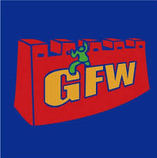

# 科学上网

## GFW - 长城高筑
防火长城（英语：Great Firewall of China，常用简称：GFW，中文也称中国国家防火墙，中国大陆民众俗称防火墙等），是对中华人民共和国政府在其互联网边界审查系统（包括相关行政审查系统）的统称。此系统起步于1998年，其英文名称得自于2002年5月17日Charles R. Smith所写的一篇关于中国网络审查的文章《The Great Firewall of China》，取与Great Wall（长城）相谐的效果，简写为Great Firewall，缩写GFW。随着使用的拓广，中文“墙”和英文“GFW”有时也被用作动词，网友所说的“被墙”即指被防火长城所屏蔽。

## 翻墙 - 哪里有压迫，哪里就有反抗
GFW阻挡了我们享受网络自由，但人们对于自由的渴望与追求从未止步。有“墙”，自然就有人“翻墙”。翻墙早已成为社会主义特色的一部分，不知道儿孙们以后看到我们现在的状态会做何感想，可能会像我们现在不能体会那些莫名其妙的明清文字狱一样。

你问我翻墙的价值是什么。那我告诉你，

为了工作，为了学习，为了感受生活，为了看到墙内没有的东西，为了了解真相，为了知道这个世界究竟是什么样的，为了自己不是一直傻傻地走过这一遭，为了不被儿孙们耻笑……

## 翻墙技术 - 这就搞起来

翻墙技术有很多，各种梯子，各种代理，各种翻墙工具，不胜枚举。VPN，SS，SSR，V2Ray,Brook，WireGuard等各种技术与协议也是百花齐放...

现有的VPN和SS/SSR技术算是比较流行的翻墙技术，但也相对陈旧了一些，我们这里就不做过多介绍了。我们这里主要介绍一下目前相对稳定安全快速的V2Ray，小众种子选手Brook和下一代VPN未来的WireGuard。

* [下一代VPN协议 - WireGuard](wg.md)
* [全能翻墙工具 - V2Ray](v2ray.md)
* [小众好用的代理软件 — Brook](brook.md)