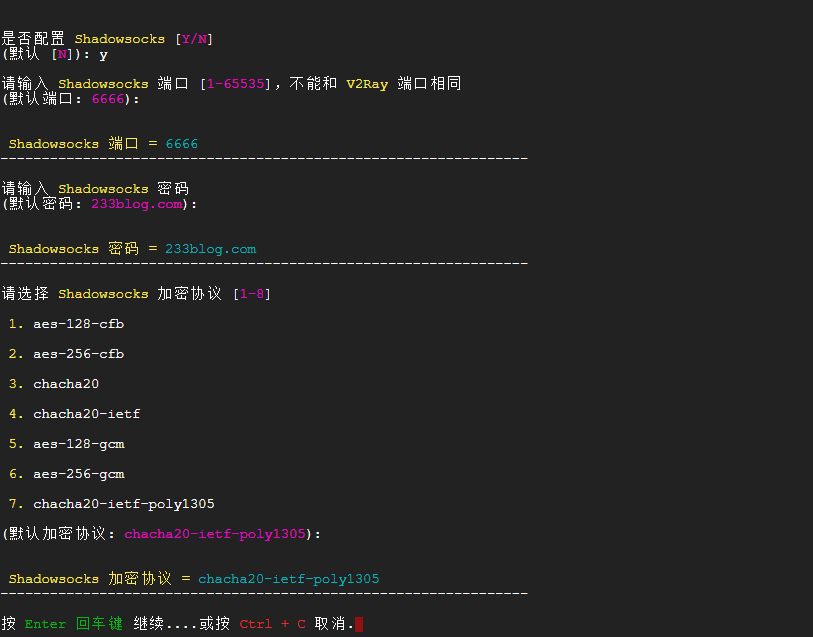

# 全能翻墙工具 - V2Ray

## 1. V2Ray简介
V2Ray(Project V) 相对于 Shadowsocks，V2Ray 更像全能选手，拥有更多可选择的协议 / 传输载体 (Socks、HTTP、TLS、TCP、mKCP、WebSocket )，还有强大的路由功能，不仅仅于此，它亦包含 Shadowsocks 组件，你只需要安装 V2Ray，你就可以使用所有的 V2Ray 相关的特性包括使用 Shadowsocks，由于 V2Ray 是使用 GO 语言所撰写的，天生的平台部署优势，下载即可使用。

## 2. V2Ray上手
### 2.1 服务端
除了使用第三方提供的V2Ray节点外，相信小伙伴们已经迫不及待的想自建服务器，小试身手了，话不多说，这就操练起来吧...

系统要求：Ubuntu 14+ / Debian 7+ / CentOS 7+
```sh
$ sudo -i
$ cp /usr/share/zoneinfo/Asia/Shanghai /etc/localtime
$ bash <(curl -s -L https://233yes.com/v2ray.sh)
```
按照提示安装即可...


配置 Shadowsocks(可选)


安装完成


> 常用操作

操作|命令
:-|:-
v2ray info | 查看 V2Ray 配置信息
v2ray config | 修改 V2Ray 配置
v2ray link | 生成 V2Ray 配置文件链接
v2ray infolink | 生成 V2Ray 配置信息链接
v2ray qr | 生成 V2Ray 配置二维码链接
v2ray ss | 修改 Shadowsocks 配置
v2ray ssinfo | 查看 Shadowsocks 配置信息
v2ray ssqr | 生成 Shadowsocks 配置二维码链接
v2ray status | 查看 V2Ray 运行状态
v2ray start | 启动 V2Ray
v2ray stop | 停止 V2Ray
v2ray restart | 重启 V2Ray
v2ray log | 查看 V2Ray 运行日志
v2ray update | 更新 V2Ray
v2ray update.sh | 更新 V2Ray 管理脚本
v2ray uninstall | 卸载 V2Ray

### 2.2 客户端
V2Ray 搭建好了，自然要配置客户端使用咯~

V2Ray支持
[Windows](https://233yes.com/post/8/)/
[mac OS](https://233yes.com/post/9/)/
Linux/
[Android](https://233yes.com/post/12/)/
[iOS](https://233yes.com/post/11/)
等主流平台。

除Linux外，所有客户端都是简单的图形界面操作，在此不再赘述。有不明白读者，点击参考以上连接即可。