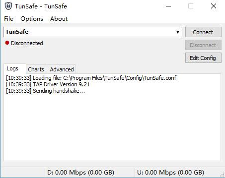
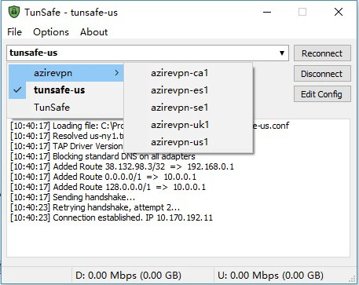
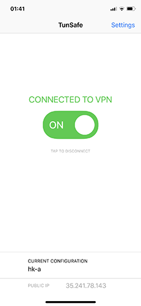
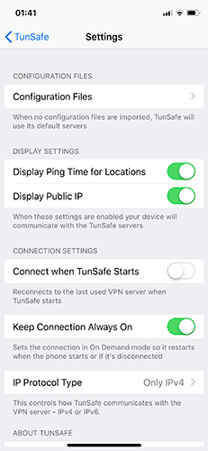

# WireGuard

* [1.WireGuard简介](#1-wireguard简介)
* [2.WireGuard使用](#2-wireguard上手)
* [3.WireGuard](#3-配置解析)

## 1. WireGuard简介
[WireGuard](https://www.wireguard.com)被视为下一代VPN协议，用来替代OpenVPN，IPSec等VPN协议。
目前支持Linux,Windows,mac OS,Android,iOS等主流平台。

WireGuard协议作为Linux内核模块运行，所以效率极高。使用了最先进的加密技术(利用Curve25519进行密钥交换，ChaCha20和Poly1305用于数据认证，BLAKE2用于散列)，安全性毋庸置疑。WireGuard支持IP地址漫游，也就是网络断开再连，对它不会有影响。

WireGuard使用UDP协议传输数据，在不使用的情况下默认不会传输任何 UDP 数据包，所以比常规VPN省电很多，可以像SS一样一直挂着使用。WireGuard协议的速度瞬秒其它VPN协议。

## 2. WireGuard上手

### 2.1 服务器

除了使用第三方提供的WireGuard节点外，相信小伙伴们已经迫不及待的想自建服务器，小试身手了，话不多说，这就操练起来。

既然为Linux内核模式，那自然要部署在Linux上喽。WireGuard服务器搭建过程也非常简单，按照以下步骤执行即可。

#### 1) CentOS7

```sh
$ sudo -i 
$ yum update
$ yum install -y wget
# 使用一键安装脚本
$ wget https://raw.githubusercontent.com/hongwenjun/vps_setup/master/centos7_wireguard_install.sh
$ chmod -R 744 centos7_wireguard_install.sh
$ ./centos7_wireguard_install.sh

#
# 按照脚本提示进行安装
# 1.升级系统内核
# 2.安装wireguard
#
```

升级系统内核完成后需要重启服务器。服务器重启完毕后执行以下命令：
```sh
$ sudo -i
$ ./centos7_wireguard_install.sh

# 一键WireGuard多用户配置
$ wget -qO- https://git.io/fpnQt | bash
```

**TCP伪装**

简单介绍下这个东西,udp2raw tunnel，通过raw socket给UDP包加上TCP或ICMP header，进而绕过UDP屏蔽或QoS，或在UDP不稳定的环境下提升稳定性。可以有效防止在使用kcptun或者finalspeed的情况下udp端口被运营商限速。支持心跳保活、自动重连，重连后会恢复上次连接，在底层掉线的情况下可以保持上层不掉线。同时有加密、防重放攻击、信道复用的功能

原理大概就是在udp包的上加上tcp的包头,让路由器不会认为这是一个udp的包。说这么多，不明白？不重要，安装很简单。
```sh
$ wget -qO- https://git.io/fpKnF | bash
```
至此，WireGuard服务端安装和配置已经完成。可以通过以下命令查看客户端配置。
```sh
# 查看WireGuard状态
$ wg
# 查看客户端配置
$ cat /etc/wireguard/client.conf
```

> 防火墙设置

完成以上工作之后，不要忘记开放防火墙。鉴于不同VPS开放端口方式不同，此处不再赘述。

*理论上只开启UDP入站即可，如果不放心可以同时开放出站*

#### 2) Ubuntu/Debian
Ubuntu和Debian的安装过程与CentOS相同，只是使用的一键安装脚本不同，此处只提供差异的一键安装脚本，安装过程不再赘述。
``` sh
# 一键安装wireguard 脚本 Ubuntu
wget -qO- git.io/fpcnL | bash

# 一键安装wireguard 脚本 Debian 9
wget -qO- git.io/fptwc | bash
```

## 2.2 客户端
### 2.2.1 电脑端
#### 1) mac OS/Linux
由于还处在测试阶段，mac目前还没有正式版本，只能通过命令行模式使用。

* **wireguard-tools**

    wireguard-tools是官方的命令行工具，使用略繁琐。

    ```sh
    # 安装wireguard-tools
    $ brew install wireguard-tools
    # 创建配置目录
    $ mkdir /usr/local/etc/wireguard
    #
    # 创建配置文件
    # 配置目录创建完成后，需要自己创建配置文件。配置文件内容就是前面的‘客户端配置文件’
    # vi命令使用前面已有介绍，此处不再赘述。
    $ vi /usr/local/etc/wireguard/wg0.conf

    # 启动服务
    $ sudo wg-quick up wg0 
    # 关闭服务
    $ sudo wg-quick down wg0
    # 查看WG是否启动
    $ sudo wg
    ```

* **TunSafe**
    除了官方的wireguard-tools工具，[Tunsafe](https://tunsafe.com/osx)也发布了预览版的命令行工具。使用方式略简单一些。下载地址：https://tunsafe.com/osx
    
    ```sh
    # 启动服务
    $ sudo ./tunsafe wg0.conf
    ```
    使用`Ctrl + C`退出服务。

WireGuard也为Linux提供了[客户端](https://tunsafe.com/user-guide/linux)，目前也处于测试阶段。Linux作为桌面使用较少，不再详述。

#### 2) Windows
TunSafe为Windows平台提供了简单易用WireGuard[客户端](https://tunsafe.com/download)。



1⃣️ 下载安装TunSafe WireGuard客户端，地址 https://tunsafe.com/download。因为目前测试版迭代比较快，功能也更多，使用还算稳定，推荐下载RC版

2⃣️ 导入WireGuard配置。打开TunSafe，选择Options，选择Import File…导入单个配置，或者可以拖动单个配置文件到TunSafe窗口完成导入。如果想一次性导入多个文件，可以在Options里选择Browse In Explorer，就会打开C:\Program Files\TunSafe\Config这个文件夹，然后将配置文件一起复制到这个文件夹即可

3⃣️ 点击客户端的Connect即可连接VPN。Edit Config可以编辑配置文件，文末副有配置文件编辑说明

4⃣️ 也可以将多个节点配置放到一个文件夹中，再将这个文件夹放入C:\Program Files\TunSafe\Config，TunSafe这时会将子文件夹列为二级菜单显示，如下图



##### WireGuard分流

SS/SSR用户可能习惯了PAC模式的分流，WireGuard同样支持分流。Windows版的分流较为简单，查看[此文档](https://github.com/lmc999/auto-add-routes)，几步操作实现分流。

Mac和Linux版本的客户端分流原理于Windows一直。有兴趣的读者可以参阅[此处](https://blog.mozcp.com/wireguard-usage/)。文档实现了Linux分流，Mac版路由规则略有区别。

### 2.2.2 移动端 

WireGuard移动端App使用方式较为简单，此处只提供下载地址，不再介绍如何使用。

#### 1) Android
WireGuard官方提供了[Android客户端](https://play.google.com/store/apps/details?id=com.wireguard.android)。

TunSafe也提供了[Android客户端](https://play.google.com/store/apps/details?id=com.tunsafe.app)

#### 2) iOS
TunSafe目前提供了iOS客户端，可用于iPhone和iPad。**iOS客户端需要非大陆区Apple ID下载。**





## 3. 配置解析
```sh
#客户端虚拟网络设备
[Interface]
# 本机的密钥
PrivateKey = gIIBl0OHb3wZjYGqZtgzRml3wec0e5vqXtSvCTfa42w=
# 设置UDP监听端口可以让其他客户端向本机发起连接
# ListenPort = 51820
# VPN连接成功后使用的DNS服务器
# DNS = 8.8.8.8
# 拦截所有DNS请求并强制所有DNS都通过VPN
# BlockDNS = true
# 虚拟网络设备的内网IP地址
Address = 192.168.2.2/24
# 流量拦截功能，是否拦截所有未通过tunsafe的网络请求:
#  route - 使用黑洞路由阻止所有流量(直接丢弃数据包)
#  firewall - 通过Windows防火墙阻止除tunsafe外的所有流量
#  on - 使用默认拦截机制
#  off - 关闭流量拦截
# BlockInternet = route, firewall
# MTU
# MTU = 1420
#服务器配置
[Peer]
# 服务器公钥
PublicKey = hIA3ikjlSOAo0qqrI+rXaS3ZH04Yx7Q2YQ4m2Syz+XE=
# 预共享密钥
PresharedKey  =  SNz4BYc61amtDhzxNCxgYgdV9rPU+WiC8woX47Xf/2Y=
# 需要转发流量的IP范围，如果你要把流量全部转发到服务器就填0.0.0.0/0
AllowedIPs = 192.168.2.0/24
# 服务器IP
Endpoint = 192.168.1.4:8040
# 保持连接参数
PersistentKeepalive = 25
# 当服务器作为默认网关时，是否通过隧道转发多播和广播数据包
# AllowMulticast = false
```